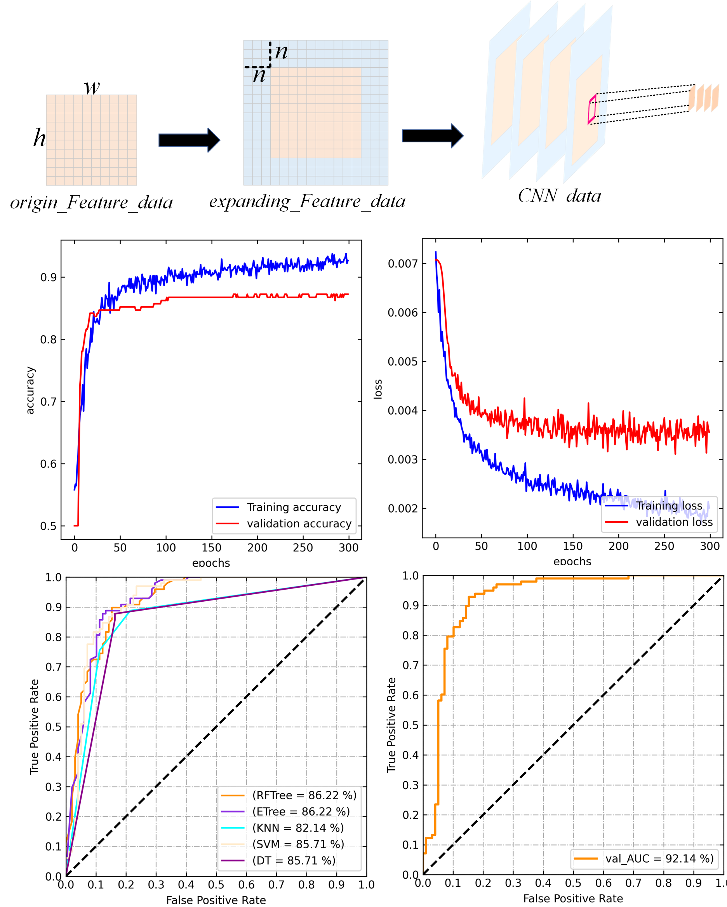

# A tool for landslide susceptibility mapping(LSM) using CNN and machine learning
<div align=center>

</div>

### Introduction
This repo aims to rapidly  generate landslide susceptibility mapping for those working in geohazards, 
and implements data construction, model training, model evaluation, and generation of landslide susceptibility mapping.
The use of an improved Spatial Pyramid Pooling (SPP) layer in front of the fully connected layer allows it to process inputs of different sizes, 
avoiding the need to redesign the network by modifying the window size.

A more further idea is whether it is possible to train a model for a larger region (self supervised), 
so that it can work well without having to train with a larger amount of data and apply it directly to another region. 
I have done some work for the love of power, the biggest problem is that I lack the data (a province),
if you are interested you can email me!
### Requirements
- GDAL  3.4.3
- torch 1.10.0+cu102
### Data preparation and checking
- Make sure your dataset structure same as:
```
parent
└─ origin_data
      ├── feature
	    |────xxx.tif
            |────...
            └────xxx.tif
      ├── label
	      ├── label1.tif
```
- Make sure your data's width, height, resolution, and projected coordinate system are consistent.
```
python data_check.py
```
### Training & Inference
- Training the CNN (for example with window_size=15,epochs=300)
```
python train_CNN.py --window_size 15 --epochs 300
```
- Training the ML (for example with model=ModelRF)
```
python train_ML.py --model ModelRF
```
- Generate the LSM (If out of memory, lower slide_window)
```
python generate_LSM.py --slide_window 512
```
### TODO
- [ ] MAE training.

If you have any questions, submit an issue or email me!
### Citation
```
@inproceedings{Zhang2022ComparingCN,
  title={Comparing Convolutional Neural Network and Machine Learning Models in Landslide Susceptibility Mapping: A Case Study in Wenchuan County},
  author={Sikui Zhang and Lin Bai and Yuanwei Li and Wei-le Li and Mingli Xie},
  booktitle={Frontiers in Environmental Science},
  year={2022},
  url={https://api.semanticscholar.org/CorpusID:248800507}
}
```
